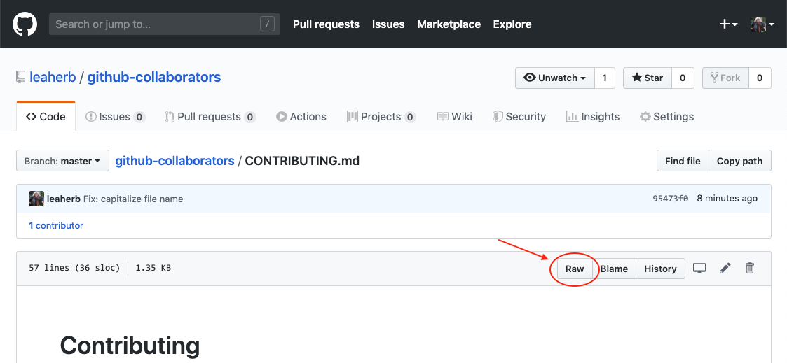

# github-collaborators

Templates for the **GitHub Collaborators study group** (*Udacity/Bertelsmann Cloud DevOps Challenge*)

## Installation

An easy way to copy these Markdown (\*.md) Template files is to view a file in 'Raw', then copy/paste its content to your own file.

  

## Contributing

See [CONTRIBUTING.md](https://github.com/leaherb/github-collaborators/blob/master/CONTRIBUTING.md) of this repository.

(Feel free to contribute by improving and adding to these templates!)
